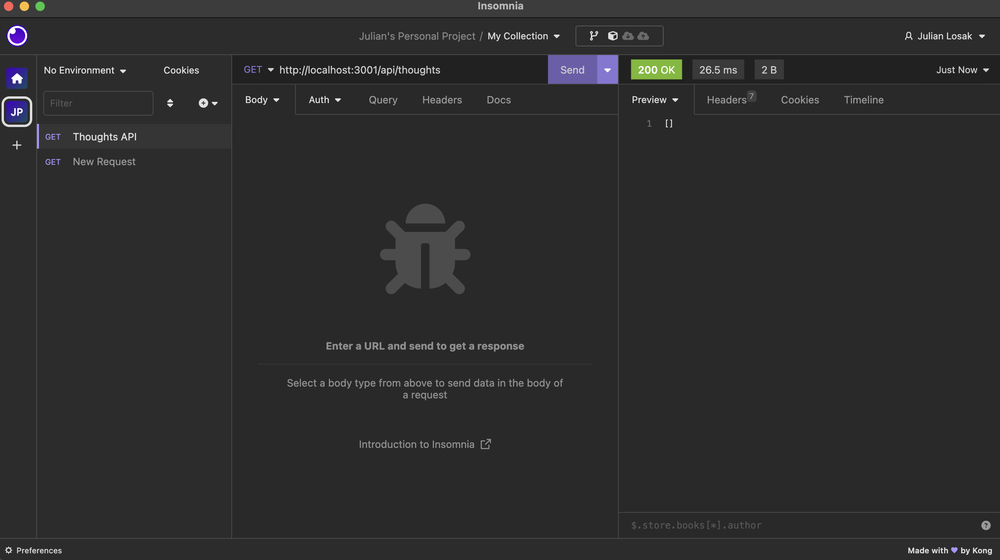

# social-network-api
social network web application where users can share their thoughts, react to friends’ thoughts, and create a friend list.
 
 # install

 clone the repository at https://github.com/julianlosak/social-network-api

 run npm i

 run npm start

 open insomnia 

 # screenshot

 